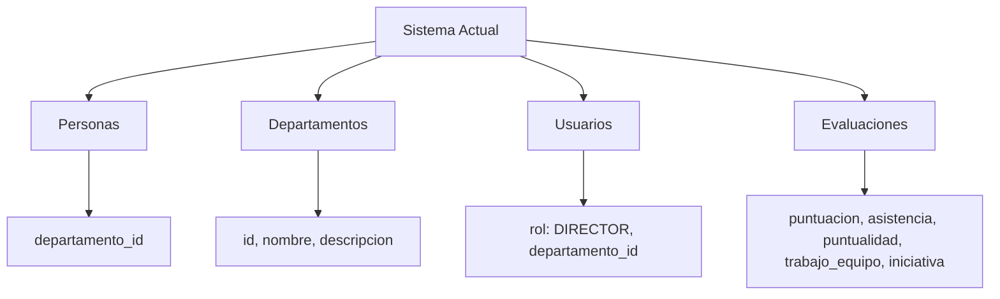
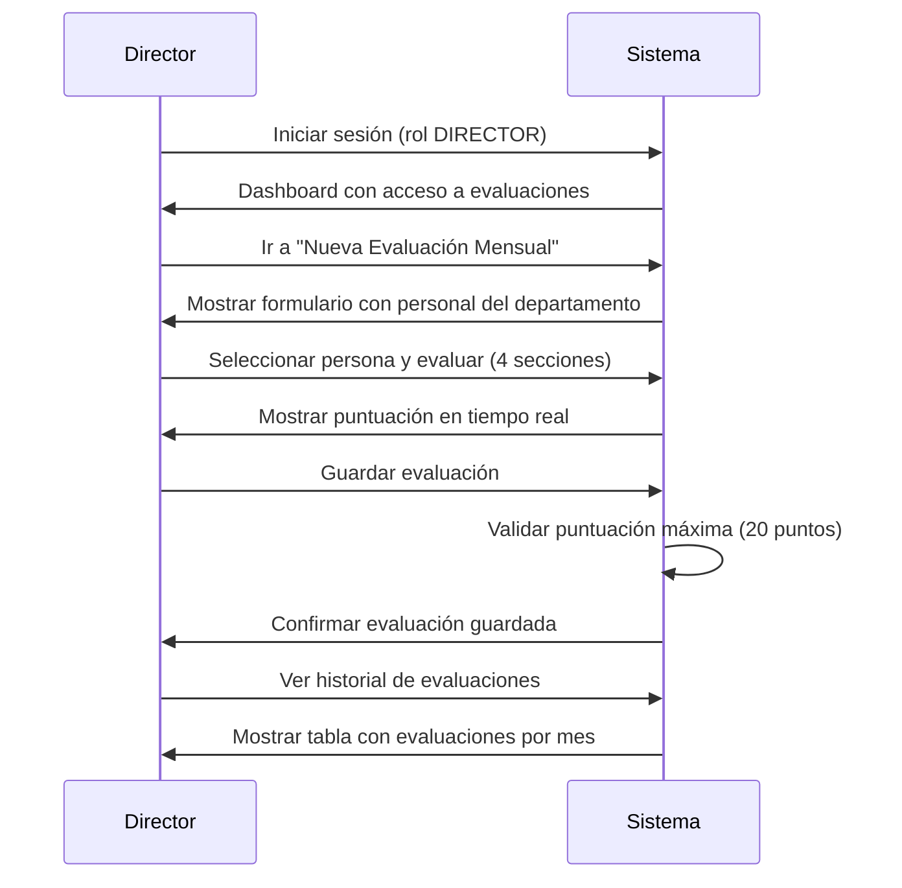

# Plan de Implementación - Esquema de Evaluación Mensual por Departamento

## 1. Análisis del Esquema de Evaluación

### 1.1 Requisitos del Esquema
El esquema de evaluación del archivo "RICARDO RIDRIGUEZ.docx" especifica:

| Requisito | Valor |
|-----------|-------|
| Calificación máxima | 20 puntos |
| Frecuencia | Mensual |
| Evaluadores | Solo directores |
| Alcance | Personal por departamento |

### 1.2 Las 4 Secciones de Evaluación

1. **Orientación de Resultados** - Evaluación del cumplimiento de objetivos y metas
2. **Calidad y Organización** - Evaluación de la calidad del trabajo y organización
3. **Relaciones Interpersonales y Trabajo en Equipo** - Evaluación de la interacción con compañeros
4. **Iniciativa** - Evaluación de la proactividad y propuestas de mejora

---

## 2. Análisis del Sistema Actual

### 2.1 Estructura Existente Relevante



### 2.2 Campos Existentes en Evaluaciones

| Campo Actual | Uso Actual | Adaptación Propuesta |
|--------------|------------|---------------------|
| puntuacion | Puntuación total | Puntuación total (0-20) |
| asistencia | Asistencia | Orientación de Resultados |
| puntualidad | Puntualidad | Calidad y Organización |
| trabajo_equipo | Trabajo en equipo | Relaciones Interpersonales |
| iniciativa | Iniciativa | Iniciativa |
| tipo_evaluacion | Tipo de evaluación | Usar "MENSUAL" |

---

## 3. Plan de Implementación

### 3.1 Fase 1: Estructura de Base de Datos

**Objetivo**: Adaptar la tabla de evaluaciones para soportar el nuevo esquema

#### Tareas:
- [ ] Crear migración para adicionar campos de evaluación específicos
- [ ] Agregar campo `departamento_id` a tabla evaluaciones (para trazabilidad)
- [ ] Agregar campo `mes_evaludado` (formato YYYY-MM) para evaluaciones mensuales
- [ ] Agregar campo `estado_evaluacion` (PENDIENTE, COMPLETADA)

#### Estructura de tabla propuesta:

```php
// Nueva migración - Agregar campos para esquema de evaluación
$fields = [
    'departamento_id' => ['type' => 'INT', 'null' => true],
    'mes_evaluado' => ['type' => 'VARCHAR', 'constraint' => 7], // YYYY-MM
    'estado_evaluacion' => ['type' => 'VARCHAR', 'constraint' => 20, 'default' => 'PENDIENTE'],
    // Campos específicos para las 4 secciones (0-5 puntos cada uno)
    'orientacion_resultados' => ['type' => 'DECIMAL', 'constraint' => '3,2', 'default' => 0],
    'calidad_organizacion' => ['type' => 'DECIMAL', 'constraint' => '3,2', 'default' => 0],
    'relaciones_interpersonales' => ['type' => 'DECIMAL', 'constraint' => '3,2', 'default' => 0],
    'iniciativa' => ['type' => 'DECIMAL', 'constraint' => '3,2', 'default' => 0],
    // Observaciones por sección
    'obs_orientacion' => ['type' => 'TEXT', 'null' => true],
    'obs_calidad' => ['type' => 'TEXT', 'null' => true],
    'obs_relaciones' => ['type' => 'TEXT', 'null' => true],
    'obs_iniciativa' => ['type' => 'TEXT', 'null' => true],
];
```

### 3.2 Fase 2: Modelo de Datos

**Objetivo**: Actualizar EvaluacionModel para manejar el nuevo esquema

#### Tareas:
- [ ] Actualizar `allowedFields` con nuevos campos
- [ ] Crear método `calcularPuntuacionEsquema()` que sume las 4 secciones
- [ ] Validar que la puntuación máxima sea 20 puntos
- [ ] Crear método `getEvaluacionMensual()` para obtener evaluación del mes actual
- [ ] Crear método `getHistorialMensual()` para obtener historial por mes

#### Método de cálculo propuesto:

```php
public function calcularPuntuacionEsquema($data)
{
    $puntuacion = 0;
    $secciones = ['orientacion_resultados', 'calidad_organizacion', 
                  'relaciones_interpersonales', 'iniciativa'];
    
    foreach ($secciones as $seccion) {
        if (isset($data[$seccion]) && $data[$seccion] > 0) {
            $puntuacion += floatval($data[$seccion]);
        }
    }
    
    // Validar máximo de 20 puntos
    return min(round($puntuacion, 2), 20.00);
}
```

### 3.3 Fase 3: Control de Acceso

**Objetivo**: Implementar restricciones para que solo directores evalúen

#### Tareas:
- [ ] Actualizar el filtro de autenticación para verificar rol DIRECTOR
- [ ] Crear verificación de departamento: director solo evalúa su personal
- [ ] Crear middleware `EvaluacionAccessFilter` para proteger rutas

#### Lógica de acceso propuesta:

```php
// En EvaluacionController
public function canEvaluate($userId, $personaId)
{
    $usuario = $this->userModel->find($userId);
    $persona = $this->personaModel->find($personaId);
    
    // Solo directores
    if ($usuario['rol'] !== 'DIRECTOR') {
        return false;
    }
    
    // Solo su departamento
    return $usuario['departamento_id'] === $persona['departamento_id'];
}
```

### 3.4 Fase 4: Interfaz de Usuario

**Objetivo**: Crear formulario de evaluación con las 4 secciones

#### Tareas:
- [ ] Crear vista `evaluaciones/director/create.php` para evaluaciones mensuales
- [ ] Mostrar las 4 secciones con campos de puntuación (0-5 puntos cada una)
- [ ] Agregar campos de observación por sección
- [ ] Mostrar puntuación total en tiempo real (máximo 20 puntos)
- [ ] Lista desplegable de personal del departamento del director

#### Diseño del formulario:

```
╔═══════════════════════════════════════════════════════════╗
║          EVALUACIÓN MENSUAL DE PERSONAL                     ║
╠═══════════════════════════════════════════════════════════╣
║ Período: [Mes Actual]                                      ║
║ Personal: [Dropdown - Personas del departamento]          ║
╠═══════════════════════════════════════════════════════════╣
║ 1. ORIENTACIÓN DE RESULTADOS (0-5 puntos)                 ║
║    [Slider 0-5]  Puntuación: ___                           ║
║    Observaciones: [textarea]                              ║
╠═══════════════════════════════════════════════════════════╣
║ 2. CALIDAD Y ORGANIZACIÓN (0-5 puntos)                    ║
║    [Slider 0-5]  Puntuación: ___                           ║
║    Observaciones: [textarea]                              ║
╠═══════════════════════════════════════════════════════════╣
║ 3. RELACIONES INTERPERSONALES Y TRABAJO EN EQUIPO         ║
║    (0-5 puntos)                                            ║
║    [Slider 0-5]  Puntuación: ___                           ║
║    Observaciones: [textarea]                              ║
╠═══════════════════════════════════════════════════════════╣
║ 4. INICIATIVA (0-5 puntos)                                ║
║    [Slider 0-5]  Puntuación: ___                           ║
║    Observaciones: [textarea]                              ║
╠═══════════════════════════════════════════════════════════╣
║ PUNTUACIÓN TOTAL: ___ / 20 puntos                          ║
╚═══════════════════════════════════════════════════════════╝
```

### 3.5 Fase 5: Historial y Estadísticas

**Objetivo**: Mostrar historial de evaluaciones por departamento

#### Tareas:
- [ ] Crear vista `evaluaciones/director/index.php` -列表 de evaluaciones del mes
- [ ] Crear vista `evaluaciones/director/historial.php` - historial por período
- [ ] Crear Panel de estadísticas por departamento:
  - Promedio de puntuación por sección
  - Tendencias mensuales
  - Comparativa entre personal

#### Métricas propuestas:

```php
// En EvaluacionModel
public function getEstadisticasDepartamento($departamentoId, $mes = null)
{
    return $this->select('
        AVG(orientacion_resultados) as avg_orientacion,
        AVG(calidad_organizacion) as avg_calidad,
        AVG(relaciones_interpersonales) as avg_relaciones,
        AVG(iniciativa) as avg_iniciativa,
        AVG(puntuacion) as avg_total,
        COUNT(*) as total_evaluaciones
    ')
    ->where('departamento_id', $departamentoId)
    ->where('mes_evaluado', $mes)
    ->first();
}
```

---

## 4. Flujo de Uso Propuesto



---

## 5. Resumen de Cambios Requeridos

| Componente | Cambios |
|------------|---------|
| Base de Datos | Nueva migración con campos de esquema |
| Modelo | Actualizar allowedFields + nuevos métodos |
| Controlador | Nuevo EvaluacionDirectorController |
| Vistas | Nuevo formulario + historial |
| Rutas | Nuevas rutas para evaluación de directores |
| Filtros | Restricción de acceso por rol y departamento |

---

## 6. Recomendaciones de Implementación

1. **Orden sugerido**: 
   - Primero Base de Datos y Modelo
   - Luego Controlador y Vistas
   - Finalmente Control de Acceso y Estadísticas

2. **Validaciones críticas**:
   - Verificar que director solo vea su departamento
   - Validar puntuación máxima de 20 puntos
   - Evitar evaluaciones duplicadas del mismo mes

3. **Compatibilidad**: Mantener el sistema de evaluaciones existente (no eliminar) para no afectar otras funcionalidades del sistema.